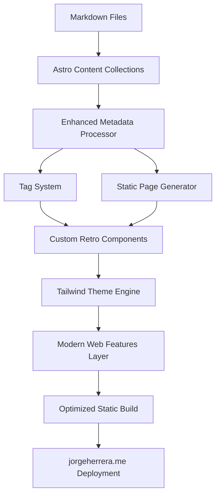
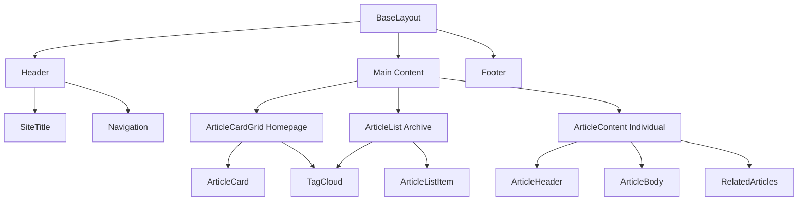

# Architecture: jorgeherrera.me Blog

## Introduction / Preamble

This document outlines the complete technical architecture for Jorge Herrera's Blog, a minimal retro-styled personal blog built with cutting-edge web technologies. The system transforms markdown files into a beautiful static website with typewriter aesthetics, modern web features, and optimal performance.

**Primary Goal:** Create a frictionless content publishing workflow that automatically converts markdown files to optimized web pages with a distinctive vintage computer terminal aesthetic.

**Relationship to UI/UX Specification:** This architecture implements the retro design system detailed in the UI/UX Specification document, focusing on monospaced typography, terminal-inspired color schemes, and subtle LEGO-inspired visual elements.

## Table of Contents

- [Technical Summary](https://claude.ai/chat/9b80cad9-0f8f-4160-bae2-dc355dcccd9a#technical-summary)
- [High-Level Overview](https://claude.ai/chat/9b80cad9-0f8f-4160-bae2-dc355dcccd9a#high-level-overview)
- [Architectural Patterns Adopted](https://claude.ai/chat/9b80cad9-0f8f-4160-bae2-dc355dcccd9a#architectural-patterns-adopted)
- [Component View](https://claude.ai/chat/9b80cad9-0f8f-4160-bae2-dc355dcccd9a#component-view)
- [Project Structure](https://claude.ai/chat/9b80cad9-0f8f-4160-bae2-dc355dcccd9a#project-structure)
- [API Reference](https://claude.ai/chat/9b80cad9-0f8f-4160-bae2-dc355dcccd9a#api-reference)
- [Data Models](https://claude.ai/chat/9b80cad9-0f8f-4160-bae2-dc355dcccd9a#data-models)
- [Modern Web Features Integration](https://claude.ai/chat/9b80cad9-0f8f-4160-bae2-dc355dcccd9a#modern-web-features-integration)
- [Definitive Tech Stack Selections](https://claude.ai/chat/9b80cad9-0f8f-4160-bae2-dc355dcccd9a#definitive-tech-stack-selections)
- [Infrastructure and Deployment Overview](https://claude.ai/chat/9b80cad9-0f8f-4160-bae2-dc355dcccd9a#infrastructure-and-deployment-overview)
- [Error Handling Strategy](https://claude.ai/chat/9b80cad9-0f8f-4160-bae2-dc355dcccd9a#error-handling-strategy)
- [Coding Standards](https://claude.ai/chat/9b80cad9-0f8f-4160-bae2-dc355dcccd9a#coding-standards)
- [Overall Testing Strategy](https://claude.ai/chat/9b80cad9-0f8f-4160-bae2-dc355dcccd9a#overall-testing-strategy)
- [Security Best Practices](https://claude.ai/chat/9b80cad9-0f8f-4160-bae2-dc355dcccd9a#security-best-practices)
- [Change Log](https://claude.ai/chat/9b80cad9-0f8f-4160-bae2-dc355dcccd9a#change-log)

## Technical Summary

Jorge's Blog leverages Astro.js static site generation with Tailwind CSS for a high-performance, content-focused blog. The system features cutting-edge web technologies including View Transitions API, CSS Container Queries, and advanced color management, all wrapped in a retro computer terminal aesthetic. Content is managed through simple markdown files with minimal frontmatter, automatically processed into optimized static pages deployed to jorgeherrera.me.

## High-Level Overview

**Architecture Style:** Enhanced Static Site Generation with Modern Web Features **Repository Structure:** Monorepo containing both content and application code **Content Strategy:** Markdown-driven with automatic processing and optimization

The system transforms markdown files placed in the content directory into fully optimized static web pages. Each article requires only title, date, and tags frontmatter, with the URL automatically generated from the filename.



## Architectural Patterns Adopted

- **Static Site Generation (SSG)** - Pre-built pages for maximum performance and simplicity
- **Content Collections Pattern** - Type-safe content management with automatic validation
- **Component Composition** - Reusable Astro components following atomic design principles
- **Theme-Driven Design** - Dynamic color theming through CSS custom properties and Tailwind configuration
- **Progressive Enhancement** - Modern web features implemented without fallbacks (latest browsers only)
- **Build-Time Optimization** - All processing happens at build time for optimal runtime performance

## Component View

### Core System Components

**Content Layer:**

- **Astro Content Collections** - Handles markdown processing and frontmatter validation
- **Tag Processing System** - Automatically extracts and organizes content by tags
- **Article Metadata Generator** - Processes dates, generates URLs from filenames

**Presentation Layer:**

- **Layout Components** - BaseLayout, Header, Footer for consistent structure
- **Content Components** - ArticleCard, ArticleList, ArticleContent for content display
- **Navigation Components** - TagCloud, TagFilter, Breadcrumb for content discovery
- **UI Components** - ThemeToggle, Tag, CodeBlock for interactive elements

**Enhancement Layer:**

- **View Transitions Manager** - Handles smooth page transitions
- **Theme System** - Manages dynamic color theming and mode switching
- **Modern CSS Features** - Container queries, advanced color functions



## Project Structure

```plaintext
jorgeherrera.me/
├── .github/
│   └── workflows/
│       └── deploy.yml              # Automated deployment workflow
├── public/
│   ├── fonts/                      # Monospace font files
│   ├── favicon.ico
│   └── robots.txt
├── src/
│   ├── components/
│   │   ├── layout/
│   │   │   ├── BaseLayout.astro
│   │   │   ├── Header.astro
│   │   │   └── Footer.astro
│   │   ├── content/
│   │   │   ├── ArticleCard.astro
│   │   │   ├── ArticleCardGrid.astro
│   │   │   ├── ArticleList.astro
│   │   │   ├── ArticleListItem.astro
│   │   │   └── ArticleContent.astro
│   │   ├── navigation/
│   │   │   ├── TagCloud.astro
│   │   │   ├── Tag.astro
│   │   │   └── Breadcrumb.astro
│   │   └── ui/
│   │       ├── ThemeToggle.astro
│   │       └── CodeBlock.astro
│   ├── content/
│   │   └── blog/                   # Markdown articles
│   │       ├── thoughts-on-standardization-of-web.md
│   │       └── ...
│   ├── layouts/
│   │   ├── BaseLayout.astro
│   │   ├── BlogPost.astro
│   │   └── ArchivePage.astro
│   ├── pages/
│   │   ├── index.astro             # Homepage (cards)
│   │   ├── blog/
│   │   │   ├── index.astro         # Archive (list)
│   │   │   └── [...slug].astro     # Individual posts
│   │   ├── tags/
│   │   │   ├── index.astro
│   │   │   └── [tag].astro
│   │   ├── about.astro
│   │   └── rss.xml.js
│   ├── styles/
│   │   ├── global.css              # @import "tailwindcss"
│   │   └── theme.css               # CSS custom properties
│   ├── utils/
│   │   ├── blog.ts
│   │   └── tags.ts
│   └── types/
│       └── blog.ts
├── astro.config.mjs
├── tailwind.config.mjs
├── vercel.json
└── package.json
```

## API Reference

### Content Collections API

**Blog Collection Schema:**

```typescript
const blogCollection = defineCollection({
  type: 'content',
  schema: z.object({
    title: z.string(),
    date: z.coerce.date(),
    tags: z.array(z.string()).default([]),
  }),
});
```

**Example Article Frontmatter:**

```yaml
---
title: Thoughts on standardization of the web
date: 2022-12-27
tags:
  - Web
---
```

### Content Processing APIs

**Core Blog Functions:**

```typescript
// Get all articles, sorted by date
export async function getAllArticles(): Promise<Article[]>

// Get articles by specific tag
export async function getArticlesByTag(tagName: string): Promise<Article[]>

// Get all tags with article counts
export async function getAllTags(): Promise<Tag[]>
```

## Data Models

### Article Data Model

```typescript
export interface Article {
  id: string;
  slug: string; // Generated from filename
  body: string;
  data: {
    title: string;
    date: Date;
    tags: string[];
  };
}
```

### Tag Data Model

```typescript
export interface Tag {
  name: string;
  count: number;
  articles: Article[];
}
```

## Modern Web Features Integration

### View Transitions API

- **Full implementation** without fallbacks for seamless page transitions
- **Retro-styled animations** that complement the terminal aesthetic
- **Named transitions** for specific UI elements

### CSS Container Queries

- **Component-level responsive design** for modular layouts
- **No feature detection needed** - assume full browser support
- **Advanced container styling** for theme-aware components

### Cutting-Edge CSS

- **CSS Cascade Layers** for organized styling hierarchy
- **OKLCH color space** for perceptually uniform colors
- **CSS Nesting** without preprocessors
- **Modern selectors** including `:has()` for contextual styling

### Latest JavaScript Features

- **ES2024+ syntax** including top-level await and import assertions
- **Latest array methods** for content processing
- **Modern View Transitions API** with latest syntax

## Definitive Tech Stack Selections

| Category       | Technology     | Version | Description                                    | Justification                                     |
| :------------- | :------------- | :------ | :--------------------------------------------- | :------------------------------------------------ |
| **Framework**  | Astro.js       | Latest  | Static site generator with content collections | Superior markdown processing, optimal performance |
| **Styling**    | Tailwind CSS   | Latest  | Utility-first CSS framework                    | Complete customization control, dynamic theming   |
| **Language**   | TypeScript     | Latest  | Type-safe development                          | Content validation, development productivity      |
| **Runtime**    | Node.js        | 20.x    | Development and build environment              | Modern JavaScript features support                |
| **Content**    | Markdown       | N/A     | Article format with frontmatter                | Simple, focused content creation                  |
| **Deployment** | Vercel         | N/A     | Static hosting with automatic builds           | Zero-config Astro support, optimal performance    |
| **Fonts**      | JetBrains Mono | Latest  | Primary monospace font                         | Excellent readability for code and prose          |
| **Icons**      | ASCII/Unicode  | N/A     | Text-based indicators                          | Maintains retro aesthetic                         |

## Infrastructure and Deployment Overview

- **Cloud Provider:** Vercel (recommended) with automatic Git deployments
- **Core Services:** Static hosting, CDN, automatic SSL certificate management
- **Deployment Strategy:** Git-based continuous deployment triggered by content commits
- **Environments:** Production deployment to jorgeherrera.me
- **Environment Promotion:** Direct deployment from main branch
- **Rollback Strategy:** Git-based rollback through Vercel dashboard

**Build Configuration:**

```javascript
// astro.config.mjs
export default defineConfig({
  site: 'https://jorgeherrera.me',
  integrations: [tailwind(), sitemap()],
  experimental: { viewTransitions: true },
  build: { inlineStylesheets: 'auto' },
  compressHTML: true,
});
```

## Error Handling Strategy

- **General Approach:** Simple, clean error handling that maintains vintage aesthetic
- **Build-Time Validation:** Astro content collections provide automatic schema validation
- **404 Pages:** Minimal retro-styled error pages with clear navigation
- **Missing Content:** Simple fallback messages for empty states
- **Logging:** Standard console.error for development debugging
- **Error Prevention:** TypeScript and build-time validation prevent most runtime errors

## Coding Standards

### TypeScript Configuration

- **Strict Mode:** All TypeScript strict flags enabled
- **Type Safety:** All content processing is fully typed
- **Import Strategy:** ES modules exclusively

### Astro Component Standards

- **File Naming:** PascalCase for components (ArticleCard.astro)
- **Component Props:** Typed interfaces for all component properties
- **Content Processing:** Build-time processing preferred over runtime

### CSS Standards

- **Tailwind First:** Use Tailwind utilities before custom CSS
- **CSS Custom Properties:** For dynamic theming values only
- **Class Naming:** Follow Tailwind conventions, use Tailwind classes

### Content Standards

- **Frontmatter:** Minimal required fields (title, date, tags)
- **URL Generation:** Automatic from filename without extension
- **Tag Format:** Simple string array, case-sensitive

## Overall Testing Strategy

- **Build Validation:** Astro's content collections provide automatic content validation
- **Type Checking:** TypeScript compilation ensures type safety
- **Performance Testing:** Lighthouse audits for Core Web Vitals compliance
- **Manual Testing:** Browser testing for modern web features
- **Content Testing:** Markdown processing validation during build

## Security Best Practices

- **Static Generation:** No server-side code eliminates most security vectors
- **Content Sanitization:** Markdown processing includes automatic XSS prevention
- **HTTPS Enforcement:** Automatic SSL through hosting platform
- **Dependency Security:** Regular npm audit for vulnerability scanning
- **Build Security:** Content validation prevents malicious frontmatter injection

## Key Reference Documents

- **UI/UX Specification:** Complete design system and component specifications
- **Project Brief:** Original project requirements and vision
- **Product Requirements Document:** Detailed feature requirements and user stories

## Change Log

|Change|Date|Version|Description|Author|
|---|---|---|---|---|
|Initial Creation|2025|1.0|Complete architecture for Jorge's retro blog|Architect (Fred)|

---

## Frontend Architecture Prompt

This architecture document provides the complete technical foundation for Jorge's Knowledge Crystallization Blog. The system is designed around cutting-edge web technologies with a retro aesthetic, optimized for personal knowledge management and content creation. Please proceed with 'Frontend Architecture Mode' to define the detailed frontend implementation specifications, focusing on the Tailwind CSS theme system, component architecture, and modern web features integration outlined in this document.

---

## Next Steps Summary

Your architecture is now complete and ready for implementation! The system provides:

✅ **Minimal Content Workflow** - Simple markdown with title, date, tags ✅ **Cutting-Edge Web Technologies** - View Transitions, Container Queries, modern CSS  
✅ **Retro Aesthetic System** - Terminal colors, monospace typography, LEGO accents ✅ **Optimal Performance** - Static generation, build-time optimization ✅ **Simple Deployment** - Git-based workflow to jorgeherrera.me

The architecture balances your vision for a minimal vintage experience with modern web capabilities, creating a unique and powerful personal knowledge platform.