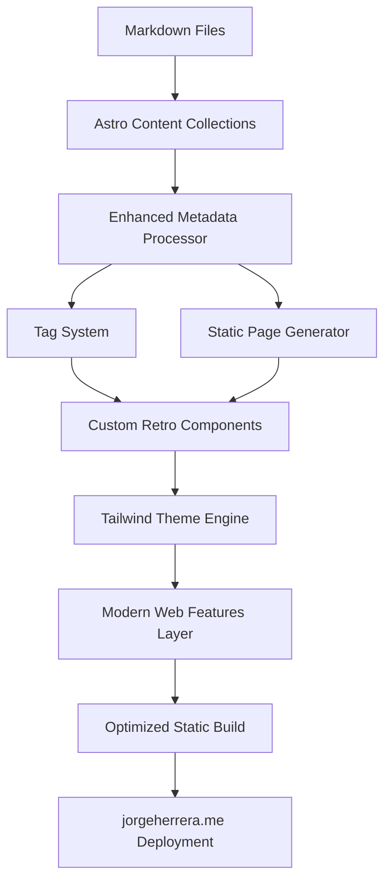

# Architecture Documentation Index

## Overview

Complete technical architecture for Jorge Herrera's Blog - a static site generation system built with Astro.js and Tailwind CSS, featuring retro computer terminal aesthetics with modern web capabilities.

## Architecture Documents

### Core Architecture
- **[Complete Architecture](../architecture.md)** - Full architectural specification
  - Technical summary and high-level overview
  - Component view and system design
  - API reference and data models
  - Modern web features integration
  - Infrastructure and deployment

### Implementation Details

#### Project Foundation
- **[Tech Stack](./tech-stack.md)** - Technology choices and versions
- **[Project Structure](./project-structure.md)** - Directory organization and file structure  
- **[Coding Standards](./coding-standards.md)** - Development conventions and practices

#### System Architecture
- **Architecture Style:** Enhanced Static Site Generation (SSG)
- **Repository Structure:** Monorepo (content + code)
- **Content Strategy:** Markdown-driven with frontmatter metadata

## Key Architectural Decisions

### Framework Selection
- **Astro.js** - Static site generator optimized for content-focused sites
- **Tailwind CSS** - Utility-first CSS for dynamic theming and precise control
- **TypeScript** - Type safety for content processing and component development

### Content Processing Pipeline

### Modern Web Features
- **View Transitions API** - Smooth page navigation
- **CSS Container Queries** - Component-level responsive design
- **OKLCH Color Space** - Perceptually uniform color management
- **CSS Cascade Layers** - Organized styling hierarchy

## Architecture Principles

1. **Content-First Design** - Everything optimized for content consumption
2. **Build-Time Optimization** - Process everything at build time for runtime performance
3. **Progressive Enhancement** - Modern features with graceful degradation
4. **Type Safety** - Full TypeScript integration for reliability
5. **Static Generation** - No server-side dependencies for simplicity and performance

## Performance Targets

- **First Contentful Paint:** < 1.5 seconds
- **Largest Contentful Paint:** < 2.5 seconds  
- **Cumulative Layout Shift:** < 0.1
- **Lighthouse Performance:** 95+ (desktop and mobile)

## Deployment Architecture

- **Hosting:** Vercel static hosting with CDN
- **Domain:** jorgeherrera.me with automatic SSL
- **Deployment:** Git-based continuous deployment
- **Build Process:** Automated via GitHub Actions/Vercel integration

## Related Documents

- **[UI/UX Specification](../front-end-spec.md)** - Design system and component specifications
- **[PRD](../prd.md)** - Requirements and feature specifications
- **[Stories](../stories/)** - Implementation tracking and development progress