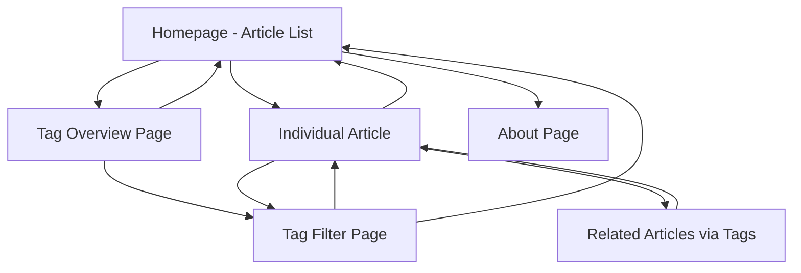
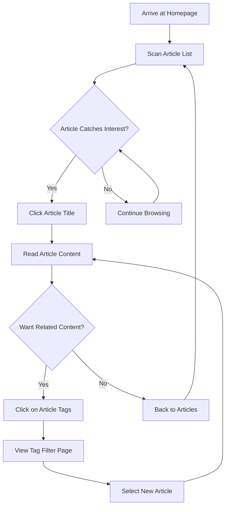
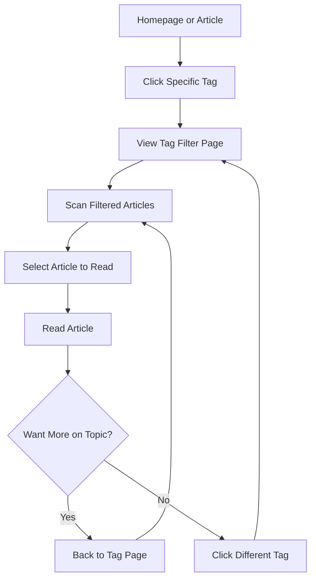

# UIUX Spec: jorgeherrera.me Blog

## Introduction

This document defines the user experience goals, information architecture, user flows, and visual design specifications for Jorge Herrera's Blog. The primary objective is to create a minimal, retro-styled personal blog that serves as a digital reading environment evoking vintage typewriter and early computer terminal aesthetics while leveraging cutting-edge web technologies.

- **Link to Primary Design Files:** To be created based on this specification
- **Link to Product Requirements Document:** Complete PRD with technical requirements and epic breakdown

## Overall UX Goals & Principles

### Target User Personas

- **Primary:** Jorge himself - technical professional who values deep thinking, clean interfaces, and efficient knowledge management
- **Secondary:** Occasional technical visitors who appreciate thoughtful content and aesthetic design

### Usability Goals

- **Immediate Content Focus:** Remove all friction between reader and content - no distracting elements, optimal reading flow
- **Nostalgic Comfort:** Create the satisfying, focused feeling of reading from a well-designed vintage computer terminal
- **Effortless Discovery:** Make finding related content intuitive through visual tag relationships and clear navigation patterns

### Design Principles

- **"Content is King":** Every design decision must enhance, never detract from, content consumption
- **"Retro Precision":** Use vintage computer aesthetics with modern precision - clean monospace, deliberate spacing, purposeful color choices
- **"Subtle Sophistication":** Modern web capabilities should feel natural and enhance the experience without calling attention to themselves
- **"Playful Vintage Touches":** Tasteful visual nods to LEGO aesthetics (colors, geometric elements, subtle textures) that complement and enhance the retro computer terminal feel

## Information Architecture (IA)

### Site Map / Screen Inventory



### Core Pages

- **Homepage/Article List:** Primary landing page showing chronological article feed with tags visible
- **Individual Article Pages:** Full reading experience with content, tags, and related article suggestions
- **Tag Overview Page:** Central hub showing all available tags with article counts
- **Tag Filter Pages:** Focused views showing all articles for a specific tag (e.g., `/tags/web-dev`)
- **About Page:** Simple personal introduction and contact information

### Navigation Structure

- **Primary Navigation:** Minimal header with site title, "Articles" (homepage), "Tags", "About"
- **Content Navigation:**
    - Article-to-article via related tags at bottom of posts
    - Tag-based filtering through clickable tag elements
    - "Back to articles" links for easy browsing return
- **Contextual Navigation:**
    - Breadcrumb-style indicators when viewing filtered content
    - Reading progress indicators for longer articles (subtle)
    - Previous/Next article navigation where logical

### Information Hierarchy

1. **Article content** (primary focus)
2. **Publication metadata** (date, reading time)
3. **Topic organization** (tags, related content)
4. **Site navigation** (minimal, unobtrusive)

## User Flows

### User Flow 1: Discovering and Reading Content (Primary Flow)

**Goal:** Reader wants to find and consume interesting technical content

**Steps / Diagram:**



### User Flow 2: Topic-Based Exploration

**Goal:** Reader wants to explore all content about a specific topic area

**Steps / Diagram:**



## Wireframes & Mockups Strategy

### Primary Design Files

- **Visual mockups will be created after this specification is complete** - either through AI UI generation tools or manual design work
- **Reference screenshots provided** serve as inspiration for layout patterns and aesthetic direction
- **This specification document** serves as the detailed requirements for any visual design work

### Key Screens Requiring Visual Design

**Homepage/Article List Layout:**

- Clean article cards or list items with title, date, excerpt, and visible tags
- Minimal header with site navigation (site title, Articles, Tags, About)
- Typography hierarchy that feels like vintage computer output but remains highly readable
- Tag elements that feel clickable and integrate with the retro aesthetic

**Individual Article Reading Experience:**

- Full-width reading layout optimized for monospaced typography
- Article header with title, publication date, reading time, tags
- Content area with proper spacing for headings, paragraphs, code blocks
- Related articles section at bottom based on shared tags
- Subtle "back to articles" navigation

**Tag-Based Views:**

- Tag overview page showing all available tags with article counts
- Tag filter pages maintaining the same article list aesthetic
- Clear indication of current filter state

### Visual Design Requirements

- **Monospaced typography system** with proper hierarchy and spacing
- **Retro computer terminal color palette** (amber, green, classic monochrome options)
- **Subtle LEGO-inspired visual elements** that complement the vintage aesthetic
- **Dark/light mode variations** of all layouts
- **Modern interaction states** (hover, focus, active) that feel consistent with the retro theme

### Design Validation Approach

- Mockups should demonstrate the typewriter aesthetic vs. other retro approaches
- Visual examples of how LEGO elements integrate without being distracting
- Typography samples showing code blocks and prose in the same system
- Color palette demonstrations across light and dark modes

## Component Library / Design System Reference

### Design System Approach

- **Custom minimal design system** built specifically for the retro typewriter aesthetic
- **No external UI library dependencies** - pure CSS/Tailwind implementation for full control
- **Monospaced typography-first** - all components designed around consistent character spacing
- **Modular component architecture** that supports the vintage computer terminal feel

### Core UI Components (Foundational Elements)

**Typography Components:**

- **Heading System:** H1-H6 using monospaced fonts with consistent sizing scale
- **Body Text:** Optimized line height and character spacing for reading comfort
- **Code Blocks:** Integrated syntax highlighting that blends with overall typography
- **Inline Code:** Subtle differentiation from body text while maintaining monospaced consistency

**Interactive Components:**

- **Navigation Links:** Clean, underlined style that feels like terminal links
- **Tag Elements:** Pill-shaped or rectangular tags with hover states that complement the retro aesthetic
- **Article Cards:** Minimal containers with subtle borders or background differences
- **Buttons:** Simple, geometric buttons that reference vintage computer interface elements

**Layout Components:**

- **Article Grid/List:** Consistent spacing and alignment for article display
- **Reading Container:** Optimal width container for article content
- **Navigation Header:** Minimal header with site branding and primary navigation
- **Content Sections:** Consistent spacing system for different content areas

**LEGO-Inspired Visual Elements:**

- **Color Accents:** Primary color system inspired by classic LEGO brick colors (red, blue, yellow, green)
- **Geometric Shapes:** Subtle rectangular elements that echo LEGO brick proportions
- **Corner Details:** Minimal rounded corners or connection points that reference LEGO studded connections
- **Hover States:** Tactile feedback that feels like clicking LEGO pieces together

### Component Interaction Patterns

- **Subtle Depth:** Minimal drop shadows or borders that suggest physical depth without being distracting
- **Click Feedback:** Brief, satisfying interactions that feel responsive and solid
- **Focus States:** Clear keyboard navigation indicators that maintain aesthetic consistency
- **Loading States:** Simple, geometric loading indicators that fit the retro theme

## Branding & Style Guide Reference

### Color Palette (Tailwind Theme Configuration)

**Primary Retro Terminal Options (via tailwind.config.js):**

- **Amber Terminal:** Custom color definitions in Tailwind theme extending default palette
- **Green Terminal:** Custom terminal-green variations
- **Classic Monochrome:** Custom gray scale optimized for retro aesthetic

**LEGO-Inspired Accent Colors (Tailwind Custom Colors):**

- **Classic Red:** Defined in Tailwind theme as custom accent colors
- **Bright Blue, Yellow, Green:** Added to Tailwind color palette for component usage

### Typography (Tailwind Font Configuration)

**Font Family Extension:**

```javascript
// tailwind.config.js
fontFamily: {
  'mono': ['JetBrains Mono', 'Fira Code', 'SF Mono', 'Monaco', 'Cascadia Code', 'Roboto Mono', 'monospace']
}
```

**Typography Scale (Tailwind Text Sizes):**

- **H1 (Article Titles):** `text-4xl` (2.25rem/36px) - Bold weight
- **H2 (Major Sections):** `text-3xl` (1.875rem/30px) - Bold weight
- **H3 (Subsections):** `text-2xl` (1.5rem/24px) - Bold weight
- **Body Text:** `text-base` (1rem/16px) - Normal weight, `leading-relaxed` (1.6)
- **Small Text (Metadata):** `text-sm` (0.875rem/14px) - Normal weight
- **Code Inline:** Slight reduction for better inline flow using custom Tailwind class

### Iconography

- **Minimal ASCII-inspired icons** where absolutely necessary
- **Geometric shapes** that reference both computer terminals and LEGO connections
- **Text-based indicators** preferred over complex icons (e.g., "→" for navigation, "•" for lists)

### Spacing & Grid (Pure Tailwind)

- **Base Unit:** Use Tailwind's default 4px/8px spacing scale (`space-4`, `p-8`, etc.)
- **Content Width:** Tailwind max-width utilities (`max-w-prose`, `max-w-4xl`)
- **Vertical Rhythm:** Consistent spacing between elements using Tailwind spacing classes
- **Component Spacing:** Tailwind margin/padding classes (`mb-6`, `py-4`)

### Visual Effects (Tailwind + CSS Custom Properties)

- **Colors:** CSS custom properties for theme switching, consumed by Tailwind classes
- **Shadows:** Tailwind shadow utilities, custom shadows added to theme if needed
- **Effects:** Minimal custom CSS only for effects not available in Tailwind (scan lines, subtle glow)

### Implementation Approach

- **Primary:** Extend Tailwind theme configuration for colors, fonts, spacing
- **Secondary:** Use CSS custom properties for dynamic theming that Tailwind classes consume
- **Last Resort:** Custom CSS only for visual effects that Tailwind doesn't provide natively

## Accessibility Requirements

### Target Compliance: WCAG 2.1 AA

Full compliance with Web Content Accessibility Guidelines 2.1 Level AA standards, with particular attention to the unique considerations of monospaced typography and retro aesthetics.

### Specific Requirements

**Color Contrast & Visual Accessibility:**

- **Text Contrast:** Minimum 4.5:1 ratio for normal text, 3:1 for large text across all theme modes
- **Interactive Elements:** Minimum 3:1 contrast ratio for UI components and graphics
- **Terminal Themes:** Amber and green terminal themes must maintain accessibility ratios while preserving authentic retro feel
- **Color Independence:** All information conveyed by color (tags, states) must also be available through text or symbols
- **Focus Indicators:** High-contrast, clearly visible focus outlines that work with retro aesthetic

**Keyboard Navigation:**

- **Complete Keyboard Access:** All interactive elements (links, tags, theme toggles) accessible via keyboard
- **Logical Tab Order:** Tab sequence follows content hierarchy (header → main content → tags → navigation)
- **Skip Links:** "Skip to main content" link for screen reader and keyboard users
- **Keyboard Shortcuts:** Standard shortcuts work correctly (Page Up/Down for long articles)

**Screen Reader Optimization:**

- **Semantic HTML:** Proper heading hierarchy (H1 → H2 → H3), landmark regions (`<main>`, `<nav>`, `<article>`)
- **Alt Text:** Descriptive alt text for any images (unlikely given minimal design, but if present)
- **ARIA Labels:** Clear labels for interactive elements, especially tag links and navigation
- **Screen Reader Testing:** Content must be comprehensible when read by screen readers

**Typography & Reading Accessibility:**

- **Monospace Readability:** Font size and line spacing optimized for users with reading difficulties
- **Scalable Text:** Content remains usable when zoomed to 200% without horizontal scrolling
- **Reading Flow:** Clear visual hierarchy that supports screen reader navigation order
- **Code Block Accessibility:** Syntax highlighting that doesn't rely solely on color for meaning

**Interactive Element Accessibility:**

- **Touch Targets:** Minimum 44px tap targets for mobile devices (tags, links, buttons)
- **Hover States:** Visual feedback that doesn't rely solely on hover (important for touch devices)
- **Clear Links:** Link purpose is clear from link text or surrounding context
- **Error Prevention:** Form validation (if any forms exist) with clear, helpful error messages

**Motion & Animation Accessibility:**

- **Respect User Preferences:** Honor `prefers-reduced-motion` settings
- **View Transitions:** Graceful fallbacks for users who disable animations
- **No Auto-Playing Content:** No automatically moving or flashing content
- **Safe Animation:** Any animations stay within safe thresholds for vestibular disorders

### Testing Requirements

- **Automated Testing:** axe-core accessibility testing integrated into build process
- **Manual Testing:** Keyboard-only navigation testing for all interactive flows
- **Screen Reader Testing:** Regular testing with NVDA, JAWS, or VoiceOver
- **Real User Testing:** Occasional testing with users who rely on assistive technologies

## Responsiveness Strategy

### Breakpoints (Tailwind CSS Default + Custom)

**Tailwind Breakpoint Strategy:**

- **Mobile First:** Base styles for mobile (320px+), then enhance for larger screens
- **sm (640px+):** Small tablets and large phones
- **md (768px+):** Tablets and small laptops
- **lg (1024px+):** Laptops and desktops (primary target)
- **xl (1280px+):** Large desktops and wide monitors

### Device Priority

1. **Desktop/Laptop (lg+):** Primary optimization target for optimal reading experience
2. **Tablet (md):** Maintain typography quality and navigation ease
3. **Mobile (sm/base):** Focus on content accessibility and core functionality

### Adaptation Strategy

**Typography Scaling:**

- **Desktop:** Full monospace hierarchy with optimal character spacing
- **Tablet:** Slightly reduced font sizes using Tailwind responsive text classes (`lg:text-xl md:text-lg`)
- **Mobile:** Further optimized for small screens while maintaining monospace character

**Layout Adaptation:**

- **Desktop:** Multi-column layouts where appropriate (tag sidebar, wide reading width)
- **Tablet:** Single-column layout with optimized spacing
- **Mobile:** Stacked layout, simplified navigation, touch-optimized interactions

**Navigation Responsiveness:**

- **Desktop:** Horizontal header navigation with all options visible
- **Tablet:** Maintained horizontal layout with adjusted spacing
- **Mobile:** Simplified navigation, potentially collapsible menu if needed

**Article List Display:**

- **Desktop:** Card or list layout with tags clearly visible
- **Tablet:** Similar layout with adjusted card sizes
- **Mobile:** Simplified list format, tags below titles for better readability

**Reading Experience:**

- **Desktop:** Optimal line length (65-75 characters), generous margins
- **Tablet:** Adjusted margins, maintained readability
- **Mobile:** Edge-to-edge reading with minimal but sufficient margins

**Interactive Elements:**

- **Desktop:** Hover states, precise cursor interactions
- **Tablet/Mobile:** Touch-optimized targets (minimum 44px), appropriate hover fallbacks

### Modern CSS Features Integration

- **Container Queries:** Use for component-level responsiveness (when components need to adapt based on their container size, not viewport)
- **CSS Clamp:** Fluid typography scaling (`clamp(1rem, 2.5vw, 1.25rem)`)
- **Flexbox/Grid:** Tailwind utilities for flexible layouts that adapt gracefully

## Change Log

|Change|Date|Version|Description|Author|
|---|---|---|---|---|
|Initial Creation|2025|1.0|Complete UI/UX Specification for Jorge's Knowledge Crystallization Blog|Design Architect (Jane)|
